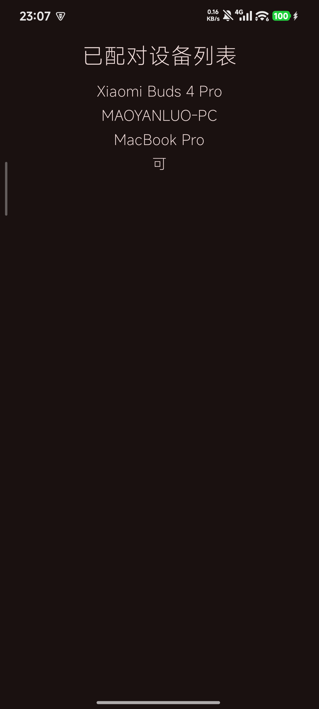
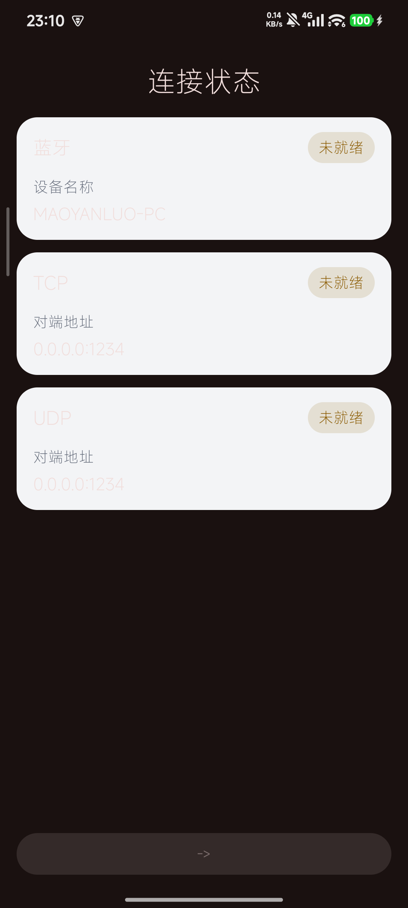
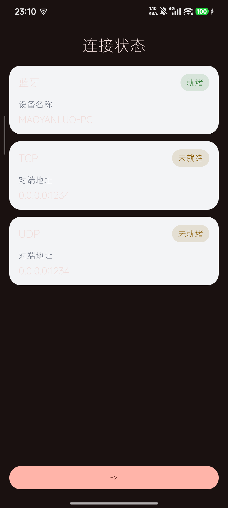
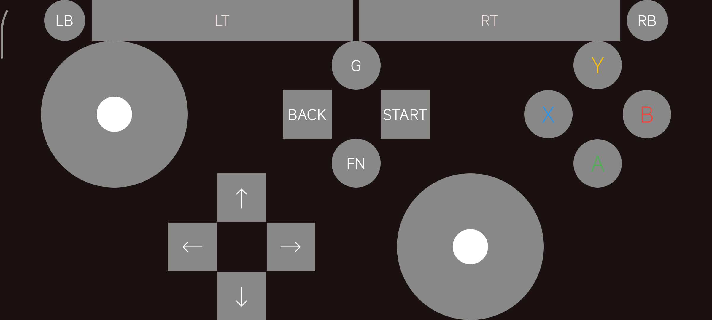

# GameControllerSimulator 2
* 用于将Android手机模拟成Xbox手柄的Demo
* 仅用于UI展示和事件处理，不进行任何手柄相关内容处理

## 使用方式
* 部署好Windows端的软件
* 编译安装app2
* 设置里和Windows设备进行配对(本App不处理配对逻辑，配对请移步系统的设置)
* 选择对端设备，然后等待就绪，大概手柄页即可

## 截图
* 
* 
* 
* 