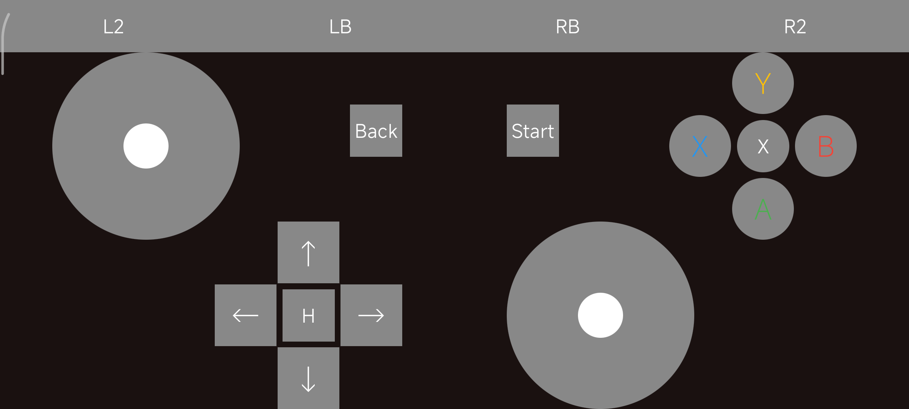

# GameControllerSimulator
* 将Android手机模拟成一个蓝牙手柄使用
* 使用Jetpack Compose编写布局，使用HID协议模拟手柄协议
* 支持Windows、macOS连接，在[手柄测试](https://www.gamepadtester.cn/)这个网站测试成功可以检测使用
* 基本上没啥实用的价值，因为手柄的HID协议就是一坨shit山
* 非要用，Windows下建议使用Steam Input转成Xbox协议使用
* 绝大部分市面上的手柄都是模拟的Xbox协议，Android无法模拟vid、pid等信息，所以只能使用通用协议
* 微软真是面子大，macOS、iOS、Android都给Xbox开发专用驱动

## 开发环境
* Android Studio
* Codex

## 使用方法
1. 编译安装App
2. 系统里和对端设备（Windows、macOS）进行配对
3. 打开App，选择要连接的设备，等待一会即可

## 截图
* 
* 