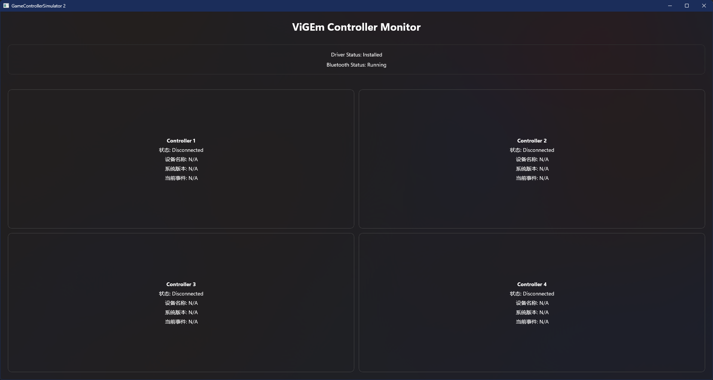
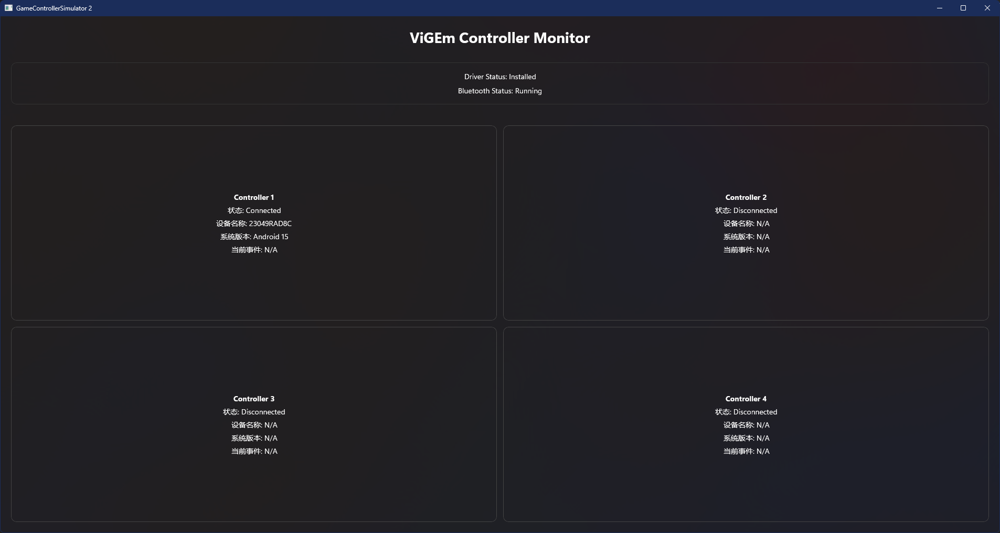
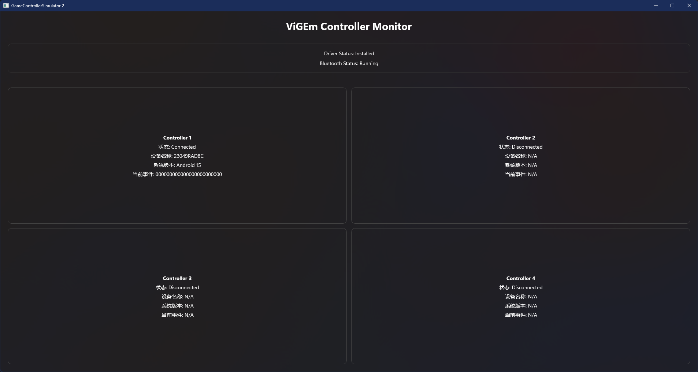
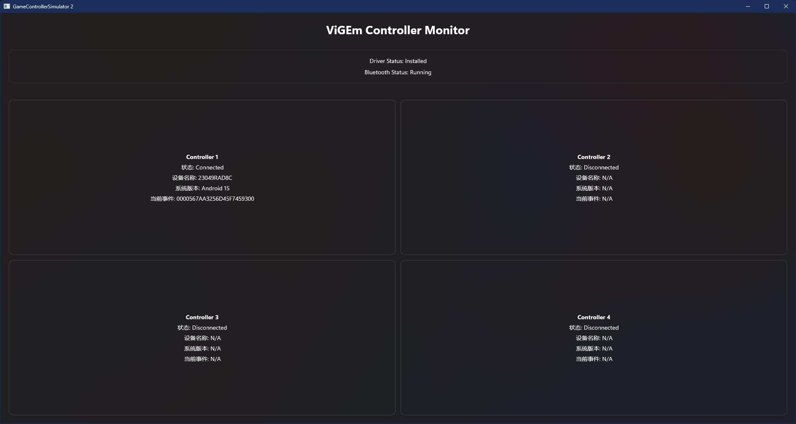

# GameControllerSimulator 2
* 用于在Windows下创建虚拟的Xbox手柄
* 使用了开源项目ViGEmBus来创建Xbox手柄驱动
* 监听手机的连接，最多支持创建4个Xbox手柄

## 开发环境
* Visual Studio
* Codex

## 使用方式
* 下载源码，然后在Visual Studio中打开
* 然后运行项目，会提示安装驱动，安装完成即可

## 截图
* 
* 
* 
* 